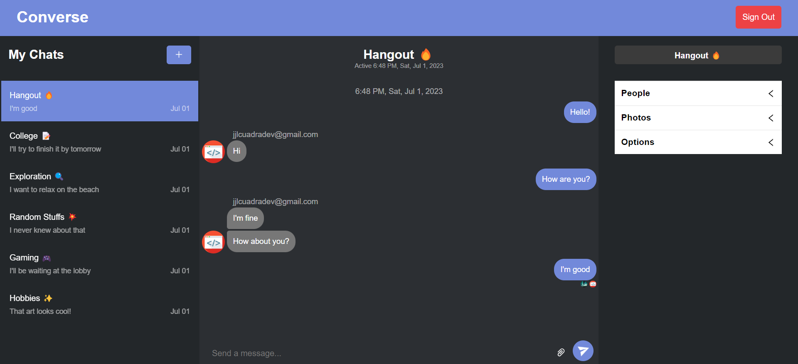
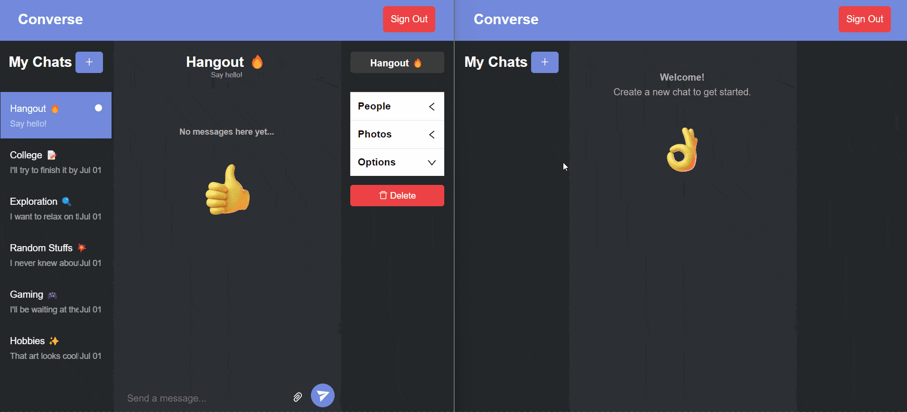

# Converse Chat App

 

A chat application where you can communicate with other people. You can create chats and messages, send images, add and remove people from chats and even keep track of who is online.

 

Made with:

- Next JS
- TypeScript
- Firebase
- [Chat Engine](https://chatengine.io/)

 

You can view the live site [here.](https://converse-chat-app-ch.vercel.app/)

 

## Demo

